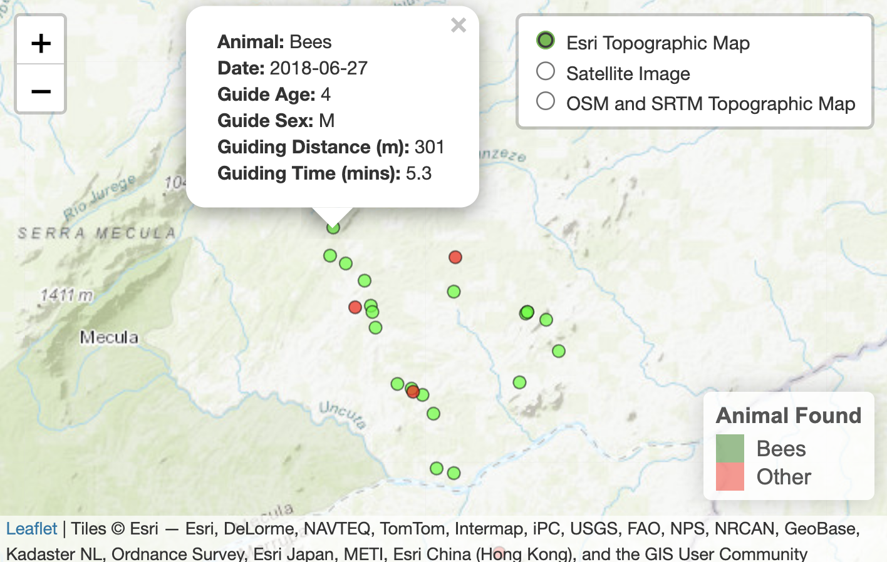

# README

## Introduction

This is my hand in for Jasper’s Honours module on GIS.

The data I have used is from David Lloyd-Jones’s github repository that
includes all of the data and code he used for his 2025 PhD thesis
entitled “Cooperation, ecology and behaviour in the honeyguide-human
mutualism”, and for his article “To bees or not to bees: greater
honeyguides sometimes guide humans to animals other than bees, but
likely not as punishment”. His repository is available
[here](https://github.com/dlloyd-jones/guiding_to_non_bees).

## The Map

I aimed to create an interactive map that compares the locations of destinations and outcomes of honey hunts in Niassa, Mozambique.
The map I produced plots the locations of trees that honeyguides guided
human honey-hunters to. In some cases, the honeyguides guided to
beehives, while in others they guided to other, sometimes dangerous,
animals. Research into this phenomenon by David Lloyd-Jones can be read
[here](https://onlinelibrary.wiley.com/doi/full/10.1002/ece3.71136). On
my map, beehive destinations are shown by green markers, and other animals
by red.

The map is interactive and can be zoomed in/out by the user. It also
features a panel where the user can select which base map they prefer.
For more information on each datapoint (including honeyguide sex and age, as well as how long and how far the hunt was), simply click the point. Here is
my [map](https://emmabethp.github.io/Honours_GIS/map.html).

And here is a snapshot of what it looks like:

